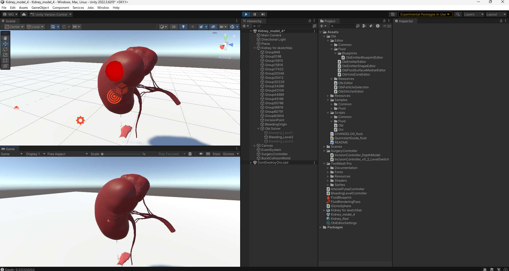

# Kidney-Bleeding-Simulation

Unity-based kidney bleeding simulation using Obi Fluid.

This project simulates a depth-responsive kidney bleeding model
for educational and minimally invasive surgical training research.

---

## Purpose

To develop a structured and reproducible bleeding severity model
for surgical education and procedural simulation research.

The system aims to provide:

* Visual comparison of bleeding severity levels
* Controlled parameter reproducibility
* Spatial incision-based activation
* Depth-dependent bleeding response

---

## Simulation Architecture

The bleeding system is organized into three predefined severity levels.

### Level1 – Mild Baseline (Venous-like)

Stable mild continuous bleeding.
Minimal pooling.
Non-pulsatile behavior.

### Level2 – Moderate Continuous Model

Increased flow intensity compared to Level1.
Higher particle velocity and pooling behavior.
Non-pulsatile configuration maintained for controlled comparison.

### Level3 – Arterial Pulsatile Model

Depth-responsive pulsatile bleeding using scripted modulation.
Simulates arterial pressure wave behavior.
Slightly exaggerated for educational visualization clarity.

Each level uses independently configured emitters
to preserve parameter stability and reproducibility.

---

## Depth-Based Incision Model (v0.5)

A raycast-driven incision model dynamically calculates incision depth:

* Initial surface contact point stored as reference
* Surface normal recorded for depth vector calculation
* Real-time depth computed using vector dot product
* Bleeding intensity scaled proportionally to incision depth

Bleeding characteristics include:

* Normal-direction offset positioning (prevents internal particle emergence)
* Surface-aligned emission vector
* Continuous (non-stepwise) intensity scaling
* Optional sinusoidal modulation for arterial pulse simulation

This enables realistic depth-dependent bleeding behavior.

---

## Interaction Model

The simulator includes raycast-based surgical interaction:

* `Camera.main` automatic camera reference
* `ScreenPointToRay` for 2D-to-3D interaction mapping
* `Physics.Raycast` for kidney collider detection
* Tag-based filtering for organ-specific interaction

This allows bleeding activation and modulation
through simulated incision input.

---

## Fluid Behavior Configuration

Key physical parameters:

* Tuned viscosity for realistic blood-like flow behavior
* Solver substeps increased to reduce particle tunneling
* Collision iterations adjusted for surface adherence
* Surface offset correction to prevent mesh penetration

These adjustments significantly improved visual plausibility
and reduced internal particle artifacts.

---

## Current Status

* Kidney model integrated
* Three-level bleeding architecture established
* Raycast-based incision activation completed
* Depth-dependent bleeding scaling implemented
* Pulsatile arterial modulation added
* Surface penetration mitigation configured
* Parameter documentation structured

---

## Future Work

* UI-based severity switching
* Hemostasis interaction modeling
* True mesh incision visualization
* Pressure-responsive bleeding adaptation
* Robotic manipulation system integration
* Quantitative evaluation metrics for training validation

---

## Development Progress

* v0.1: Constant bleeding simulation
* v0.2: Multi-level bleeding structure
* v0.3: Raycast-based incision activation
* v0.4: Pulsatile arterial model
* v0.5: Depth-responsive bleeding model with surface stabilization

---

## Screenshots

## Demo
（動画 or GIF）

## Key Features
- Depth-based bleeding response
- Pulsatile flow simulation
- Coagulation (hemostasis) interaction

## Result
- Bleeding intensity increases with depth
- Coagulation reduces bleeding over time

