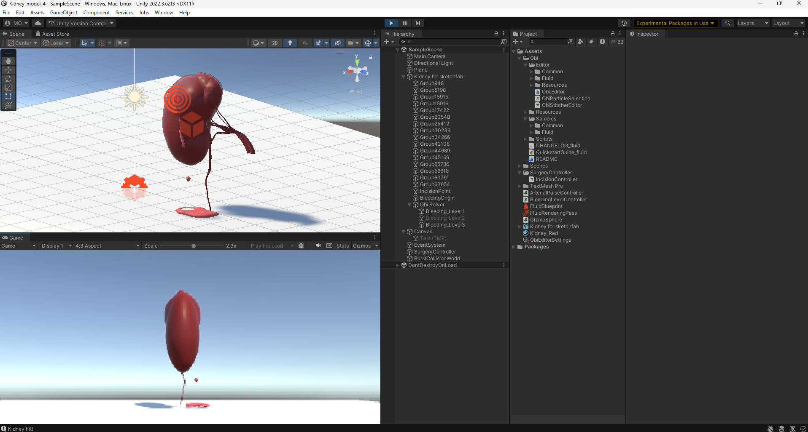

# Kidney-Bleeding-Simulation
Unity-based kidney bleeding simulation using Obi Fluid.

This project simulates controlled kidney bleeding models
for educational and minimally invasive surgical training research.

---

## Purpose
To develop a structured bleeding severity model
for surgical education and procedural simulation.

The system aims to provide:
- Visual comparison of bleeding severity levels
- Controlled parameter reproducibility
- Spatial interaction via incision-based activation

---

## Simulation Structure

The bleeding simulation is organized into three predefined severity levels.

### Level1 – Mild Baseline (Venous-like)
Stable mild continuous bleeding.
Minimal pooling.
No arterial spray behavior.

### Level2 – Moderate Continuous Model
Increased flow intensity compared to Level1.
Greater particle velocity and pooling.
Non-pulsatile behavior maintained.

### Level3 – Arterial Pulsatile Model
Pulsatile bleeding using scripted modulation.
Designed for educational visualization of arterial pressure waves.
Slightly exaggerated for clarity.

Each level is independently configured using duplicated emitters
to preserve parameter stability and reproducibility.

Detailed parameters are documented in the Development Log.

---

## Interaction Model

The simulator includes Raycast-based surgical input:

- `Camera.main` auto-reference for camera acquisition
- `ScreenPointToRay` for 2D-to-3D interaction conversion
- `Physics.Raycast` for collider-based kidney detection
- Tag-based activation control

This enables bleeding activation through simulated incision input.

---

## Current Status

- Kidney model imported
- Level1 baseline defined
- Level2 moderate model defined
- Level3 pulsatile arterial model implemented
- Raycast-based activation completed
- Educational parameter documentation structured

---

## Future Work

- UI-based severity switching
- Hemostasis interaction modeling
- Depth-based incision control
- Pressure-responsive bleeding system
- Integration with robotic manipulation research

---

## Development Progress

- v0.1: Constant bleeding simulation
- v0.2: Multi-level bleeding structure implemented
- v0.3: Raycast-based incision activation added
- v0.4: Pulsatile arterial model introduced

---

## Screenshots

