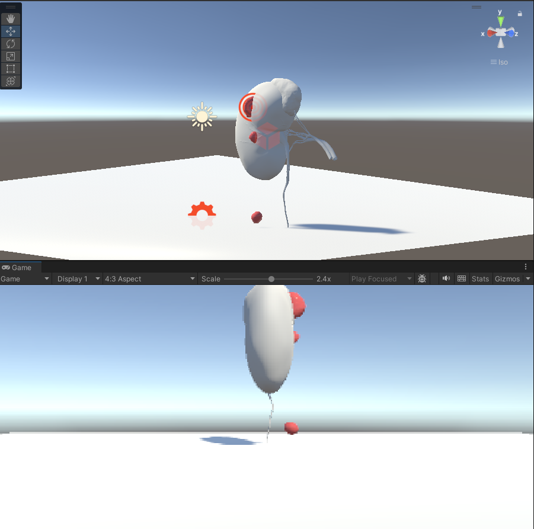

# Kidney-Bleeding-Simulation
Unity-based kidney bleeding simulation using Obi Fluid

This project simulates bleeding from a kidney model using Unity and Obi Fluid.

##The purpose 
To explore bleeding simulation for minimally invasive surgery training.

##Current Status
- Kidney modek imported
- Constant bleeding implemented
- Parameter adjustment completed

##Future Work
- Multi-level bleeding control
- Hemoatasis interaction

##Development Progress
- v0.1: Constant bleeding simulation
- v0.2: Multi-level bleeding control(planned)

##screenshot

