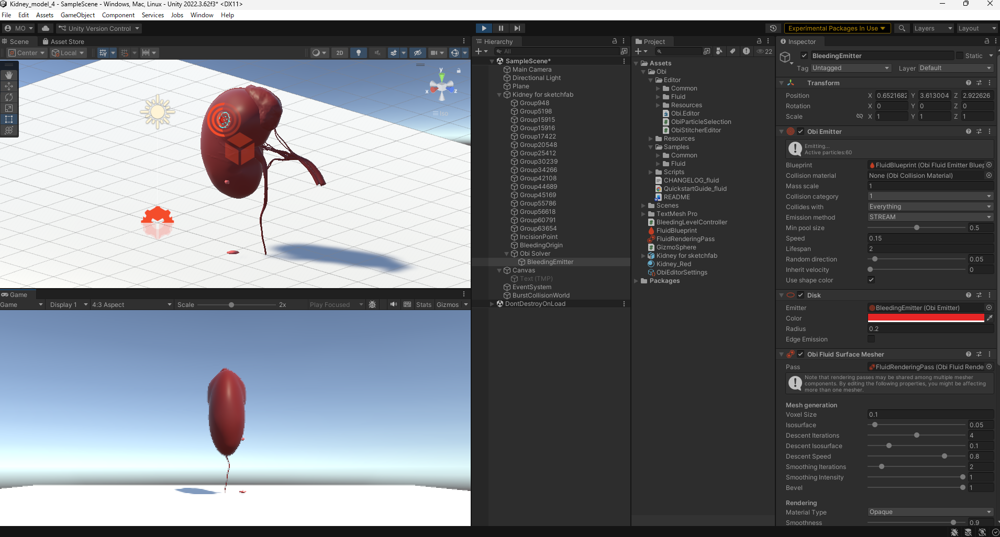
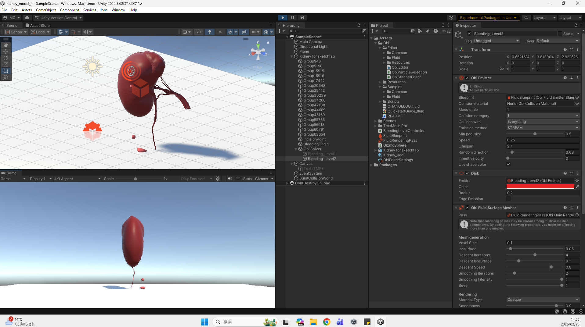
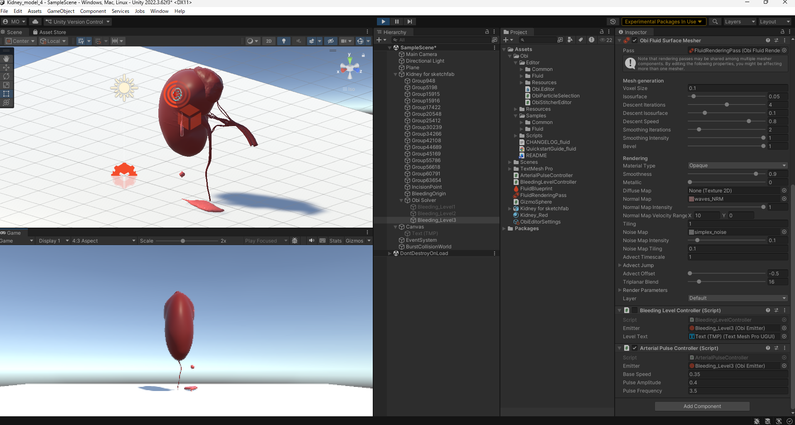

# Development Log

## 2026-02-24
- Imported Kidney 3D model
- Implemented constant bleeding using Obi Fluid
- Adjusted emitter speed（1.2）

Problems:
- Particle penetraion observed at high speed

Next:
- Add multi-level bleeding control

---

## 2026-02-27
- Implemented 3-level bleeding control(Level 1-3)
- Successfully adjusted emitter speed via key input
- Created repository
- Add README

## 2026-02-28

### Level1 Final Baseline (Fixed)

Speed: 0.15
Lifespan: 2
Radius: 0.2
Random Direction: 0.05

Description:
Stable mild continuous bleeding (venous-like oozing).
Minimal pooling.
No arterial spray behavior.

---

### Level1 Final Baseline Visualization (2026-02-28)

Parameters:
- Emission Mode: Stream
- Speed: 0.15
- Lifespan: 2.0
- Disk Radius: 0.2
- Random Direction: 0.05

Observation:
The bleeding presents as a thin, continuous venous-like oozing.
Flow remains stable without arterial spray characteristics.
Ground pooling is minimal and localized beneath the emission point.
No excessive splashing or particle penetration observed.

Interpretation:
This configuration is defined as the quantitative baseline for
mild bleeding severity (Level1) in the simulation.

---

### Level2 Implementation Log 

Speed: 0.25
Lifespan: 2.7
Radius: 0.2
Random Direction: 0.08

Description:
Moderate continuous bleeding with increased flow intensity.
Represents elevated intrarenal pressure.
Noticeable increase in volume compared to Level1.
No pulsatile arterial behavior.

---

### Level2 Baseline Visualization (2026-02-28)

Parameters:
- Emission Mode: Stream
- Speed: 0.25
- Lifespan: 2.7
- Disk Radius: 0.2
- Random Direction: 0.08

Observation:
Compared to Level1, the bleeding velocity is visibly increased.
Fluid reaches the ground with higher kinetic energy,
resulting in moderate expansion of pooling beneath the wound.
Flow remains continuous and non-pulsatile.

Interpretation:
Defined as moderate bleeding severity (Level2),
representing elevated hemodynamic pressure
without arterial pulsatile characteristics.

---

### Level3 Implementation Log (2026-02-28)

Model Type:
Arterial-like pulsatile bleeding (educational exaggeration model)

Emitter Settings:
- Emission Mode: Stream
- Lifespan: 3.5
- Disk Radius: 0.2
- Random Direction: 0.15

Pulse Controller:
- Base Speed: 0.4
- Pulse Amplitude: 0.4
- Pulse Frequency: 3.5

Behavior:
Bleeding velocity varies periodically to simulate arterial pulsation.
Flow demonstrates increased projection distance and visible pooling.
Clear visual distinction from Level1 and Level2 achieved.

Purpose:
Educational visualization of high-risk arterial bleeding state.

---

### Level3 Pulsatile Bleeding Visualization (2026-02-28)

Parameters:
- Emission Mode: Stream
- Lifespan: 3.5
- Disk Radius: 0.2
- Random Direction: 0.15
- Base Speed: 0.4
- Pulse Amplitude: 0.4
- Pulse Frequency: 3.5

Observation:
Bleeding exhibits periodic velocity variation consistent with pulsatile arterial flow.
Compared to Level2, projection distance and kinetic impact are clearly increased.
Ground pooling expands rapidly during peak pulse phases.
Flow maintains structural continuity without excessive spray dispersion.

Interpretation:
Defined as Level3 (arterial-like bleeding).
Represents a high-risk condition requiring immediate hemostatic intervention.
Model intentionally includes slight exaggeration for educational clarity.

---

### Raycast-Based Incision Model Integration (2026-02-28)

- Transitioned from global click-triggered bleeding activation to a location-specific Raycast detection model.
- Implemented `Camera.main` auto-reference for stable camera acquisition.
- Generated interaction rays using `ScreenPointToRay`.
- Verified collider-based kidney detection via `Physics.Raycast`.
- Identified and resolved tag assignment issue (applied `Kidney` tag to collider-bearing object).
- Confirmed that bleeding is triggered only when the kidney object is directly clicked.
- Validated system stability through repeated testing.

Educational Significance:
This update shifts the simulator from a generic bleeding trigger to a procedure-aware interaction model.  
Learners now initiate bleeding through deliberate anatomical targeting, reinforcing spatial awareness and controlled incision training.

---

### Level3 Arterial Model Verification (2026-02-28)

- Confirmed pulsatile bleeding behavior under Level3 settings.
- Verified visual distinction between Level2 (moderate) and Level3 (arterial) severity.
- Maintained exaggerated arterial response for educational clarity at current stage.

Educational Significance:
Level3 now provides a visually distinct high-risk bleeding scenario, enabling learners to recognize urgency and differentiate hemorrhage severity during simulated procedures.

---

## 2026-03-03

### Depth-Responsive Bleeding Model Implementation

* Implemented incision depth calculation using vector dot product.
* Stored initial surface contact point as depth reference.
* Recorded surface normal for directional projection.
* Replaced fixed threshold-based speed switching with continuous depth scaling.
* Introduced normalized depth factor (`Mathf.Clamp01`) for stable intensity mapping.
* Added optional sinusoidal modulation to simulate arterial pulsation.
* Converted bleeding intensity from stepwise activation to proportional control.

Technical Notes:

Depth calculation:

```
depth = Vector3.Dot(hit.point - incisionStartPoint, -incisionNormal)
```

Intensity normalization:

```
normalizedDepth = Mathf.Clamp01(depth / maxDepth)
emitter.speed = normalizedDepth * baseSpeed
```

Behavior:
Bleeding intensity now varies continuously according to incision depth.
Shallow cuts produce mild oozing.
Deeper incisions increase emission velocity proportionally.

Observation:
Visual transition between venous-like and arterial-like behavior
is now gradual rather than threshold-based.

Interpretation:
This update transitions the simulator from discrete severity presets
to anatomically responsive bleeding modulation.

---

### Ongoing Issues (Unresolved)

* Occasional particle penetration through kidney mesh
* Surface adherence instability at higher emission speeds
* Solver precision tuning required

These aspects will be addressed in future optimization phases.

---

### Development Phase Classification

v0.5 → Depth-based bleeding response model introduced

System now supports incision-driven dynamic bleeding behavior,
forming the foundation for future physical stabilization work.

---


