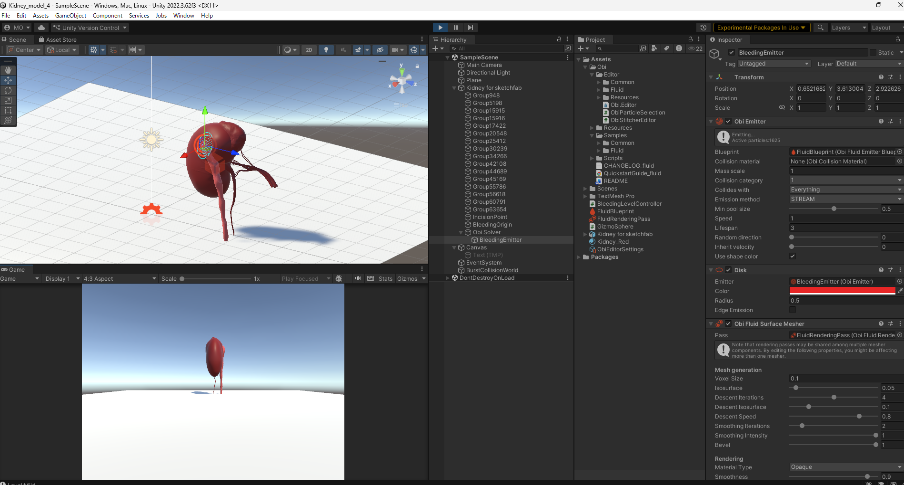

# Development Log

## 2026-02-24
- Imported Kidney 3D model
- Implemented constant bleeding using Obi Fluid
- Adjusted emitter speed（1.2）

Problems:
- Particle penetraion observed at high speed

Next:
- Add multi-level bleeding control

---

## 2026-02-27
- Implemented 3-level bleeding control(Level 1-3)
- Successfully adjusted emitter speed via key input
- Created repository
- Add README

## 2026-02-28

### Level1 Revised Baseline

Speed: 0.12〜0.15
Lifespan: 1.8〜2
Radius: 0.2

Visual impression:
Mild continuous oozing without large pooling.

### Level1 Baseline Visualization

Observation:
- Stable flow
- Moderate pooling on surface
- No excessive spray
