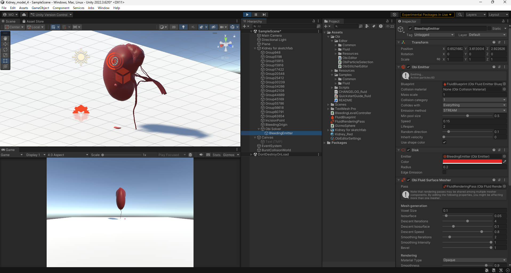

# Development Log

## 2026-02-24
- Imported Kidney 3D model
- Implemented constant bleeding using Obi Fluid
- Adjusted emitter speed（1.2）

Problems:
- Particle penetraion observed at high speed

Next:
- Add multi-level bleeding control

---

## 2026-02-27
- Implemented 3-level bleeding control(Level 1-3)
- Successfully adjusted emitter speed via key input
- Created repository
- Add README

## 2026-02-28

### Level1 Final Baseline (Fixed)

Speed: 0.15
Lifespan: 2
Radius: 0.2
Random Direction: 0.05

Description:
Stable mild continuous bleeding (venous-like oozing).
Minimal pooling.
No arterial spray behavior.

### Level1 Final Baseline Visualization (2026-02-28)

Parameters:
- Emission Mode: Stream
- Speed: 0.15
- Lifespan: 2.0
- Disk Radius: 0.2
- Random Direction: 0.05

Observation:
The bleeding presents as a thin, continuous venous-like oozing.
Flow remains stable without arterial spray characteristics.
Ground pooling is minimal and localized beneath the emission point.
No excessive splashing or particle penetration observed.

Interpretation:
This configuration is defined as the quantitative baseline for
mild bleeding severity (Level1) in the simulation.
